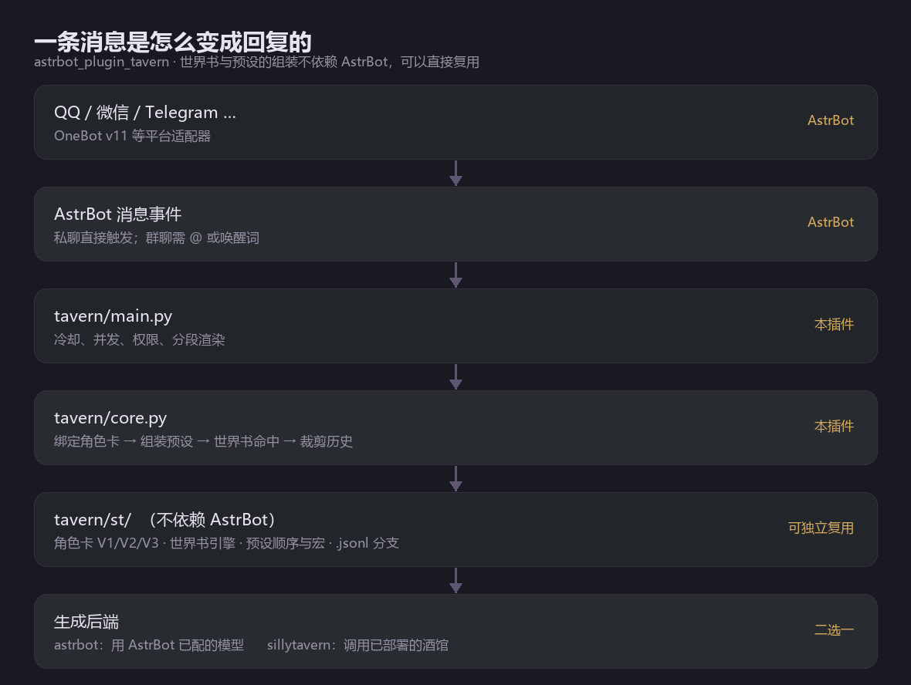

<div align="center">


# astrbot_plugin_tavern

*Bring SillyTavern's character cards, World Info and chat experience into AstrBot — roleplay inside QQ / WeChat.*


[简体中文](README.md) · **English**

</div>

---

> [!NOTE]
> The Chinese [README](README.md) is the primary document and carries more detail.
> This page covers installation, commands and the one design point worth knowing.

## What it does



| Feature | Notes |
| --- | --- |
| **Character cards** | Import SillyTavern `.json` / `.yaml` / `.png` cards (V1 / V2 / V3). Send the file to the bot and it is imported; an embedded `character_book` is extracted into a standalone world book. |
| **World Info** | V2 / V3 / AgnAI / Risu / Novel. Keyword and regex keys, selective logic, recursion, `sticky` / `cooldown` / `delay` timed effects, token budget. |
| **Branches** | Each group or DM binds its own card and chat branch; `/tavern new` starts a fresh one. |
| **Presets and macros** | Messages are assembled in SillyTavern's preset order, with `{{char}}` / `{{user}}` macros. |
| **Context budget** | Set your model's context length and old turns are dropped whole, keeping a reply reserve and the most recent turns. |
| **Segmented replies** | Long answers are split by paragraph with a typing delay; status blocks are stripped; output regexes are configurable. |
| **Management page** | A graphical page inside the AstrBot dashboard: overview, cards, world books, config, external tavern lists. |
| **External tavern** | Proxy generation to a running SillyTavern (its API keys and presets stay there), or **read-only** import its cards, world books and chats. |

## Install

**Plugin market (recommended)** — in the AstrBot WebUI, open *Plugins → Plugin Market*, search `astrbot_plugin_tavern`, install.

**Command line**

```bash
plugin i https://github.com/ppepperkok-hue/astrbot_plugin_tavern
```

**Manual** — put the repository in `data/plugins/`. The directory name **must** be `astrbot_plugin_tavern`, matching `name` in `metadata.yaml`.

Then open *Plugins → 酒馆角色扮演 → Actions → Plugin configuration*. The defaults work as-is.

> [!IMPORTANT]
> Keep your data out of the plugin directory: installs and updates overwrite it. Cards, world books, presets and chats belong under the AstrBot data directory (see the Chinese README's *Data and directories* section).

## Commands

Every command hangs off `/tavern`, which also answers to `/酒馆`.

| Command | Arguments | What it does |
| --- | --- | --- |
| `help` | — | Show the help text |
| `status` | — | Current binding, enabled world books, branch |
| `list` | — | List installed character cards |
| `use` | `<name>` | Switch card and start a new branch |
| `card` | — | Show the current card |
| `new` | — | Start a new branch |
| `history` | `[count]` | Recent messages |
| `worldbook list` | — | World books (`*` = enabled) |
| `worldbook on\|off` | `<name>` | Enable / disable a book |
| `worldbook effect` | `<book> <uid> <sticky\|cooldown\|delay> [on\|off]` | Inspect or set an entry's timed effect |
| `reload` | — | Rescan the data directory |
| `import` | — | Where to put files |
| `preview` | `[text]` | Print the **exact** prompt that would be sent this turn |
| `st cards` / `st books` / `st chats` | — / — / `<avatar>` | List the external tavern's library |
| `st import` | `card <f>` \| `book <name>` \| `chat <f> <chat>` | Import from the tavern |

`/tavern preview` is the debugging tool worth knowing: it prints what actually goes
to the model, including which World Info entries fired.

## Is it really the same as SillyTavern?

This is where most of the work went, and it is the least visible part.

`tavern/st/` is a **function-by-function port** of SillyTavern 1.19.0, not a rewrite
inspired by it. To keep it honest, the repository ships four *oracles*: Node runs the
real vendored SillyTavern source, Python runs the port, and a diff script compares
them field by field.

| Oracle | Covers | Result |
| --- | --- | --- |
| `diff.py` | world info engine | 15 fixtures, 12 match / 0 diverged / 3 not comparable |
| `diff_prompt.py` | message model | match |
| `diff_assembly.py` | message assembly | 8 fixtures, **all match** |
| `diff_converters.py` | provider wire formats | **121 fixtures, all match** |

The real engine is a better judge than intuition, and it has overruled intuition twice:

- `C++` **does** match inside `abcC++def` under whole-word matching, because both
  neighbours are `\W` rather than word characters -- the opposite of what the regex
  reads like it should do.
- Whole-word matching must use **ASCII** `\w` semantics, or a Chinese key never
  matches inside Chinese text. That was a real bug, fixed and pinned by a fixture.

`python tools/check.py` runs all of it, plus unit tests, linting, and an install of the
published archive into a clean AstrBot.

## Feedback and contributions

Found a problem, or want a feature? Please [open an issue](https://github.com/ppepperkok-hue/astrbot_plugin_tavern/issues) -- **reporting something is not a bother; it is what stops the next person from hitting the same wall.** Much of this plugin's World Info engine was ground down against real differences found in use rather than in theory.

A report is much easier to act on with:

1. your **AstrBot version** and the **plugin version**;
2. what you did, what you expected, and **what actually happened** -- including the
   complete reply from the bot, not a truncated screenshot;
3. for a command that does nothing, the two startup log lines:

```
[tavern] loaded N cards, M world books, K presets from ...
[tavern] handler binding: N bound to an instance, M bare
```

4. for anything World Info related, which entry did or did not fire --
   `/tavern preview` lists the entries activated this turn along with the keys that
   matched, which beats describing it in prose.

[docs/known-issues.md](docs/known-issues.md) records the known problems, the deliberate
trade-offs, and why each earlier mistake went unnoticed. Worth a glance first.

Pull requests are welcome too. Licensed AGPL-3.0; derivatives stay under it.

## Known limits

- **Single group chat.** One card per group or DM; there is no multi-character scene.
- **Timed effects count turns**, not chat messages (a documented, accepted difference).
- **Weighted-random and token-budget entry selection are not comparable** across the two implementations.
- **Vectorised entries** need a semantic matcher; an injectable hook exists, no built-in embedding service does.
- **`outlet` injection positions** (`position: 7`) are not implemented.
- **The external tavern integration is read-only** and deliberately has **no silent fallback**: if the tavern is down, the plugin says so rather than quietly switching to a different model mid-conversation.

## License

[AGPL-3.0](LICENSE) — use, modify and redistribute freely, but providing the service
over a network requires offering the complete source, and derivatives stay AGPL-3.0.

Formats and behaviour semantics come from [SillyTavern](https://github.com/SillyTavern/SillyTavern)
(also AGPL-3.0), which is what makes reusing its implementation legitimate. See
[THIRD_PARTY_LICENSES.md](THIRD_PARTY_LICENSES.md).
